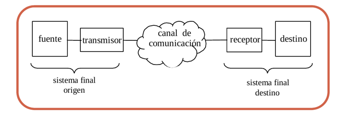

# Tema 1 | Introducción Fundamentos de redes

## 1.1 Sistemas de comunicación y redes

**¿Qué son las redes?**: Es un conjunto de equipos informáticos y software conectados entre sí por medio de dispositivos físicos que envían y reciben impulsos eléctricos, ondas electromagnéticas o cualquier otro medio para el transporte de datos, con la finalidad de compartir información, recursos y ofrecer servicios.

**¿Qué es el sistema de comunicación?** Es el conjunto de elementos y dispositicos involucrado en la transmisión de información entre dos puntos remotos, estos elementos son:

  

  - **Fuente**: Dispositivo que genera los datos a transmitir. (P.ej. un
    teléfono o un PC)

  - **Transmisor**: Por lo general los datos los genera la fuente, pero no los
  transmite en el formato que los genera. El transmisor, transforma y codifica
  esta información, normalmente en forma de señales Electromagnéticas (EM)
  susceptibles de ser transmitidas a través de algún sistema de transmisión o
  medio.

  - **Sistema de transmisión**: Medio a través del cual se produce el envío de
  información. Puede ser tan simple como una línea de trasmisión, hasta
  una red compleja compuesta por diferentes tecnologías.

  - **Receptor**: Elemento que recibe la información en forma de señal EM a
  través del sistema de transmisión. El receptor transforma esta señal de
  manera que el destino pueda interpretar de manera correcta el
  contenido de dicha información.

  - **Destino**: Último elemento que intervienen en el proceso de
  comunicación. Es el encargado de tomar los datos procesados por el
  receptor.

**¿Tareas del sist. comunicación?**:
  - Utilización del sistema de transmisión      ->  Direccionamiento     
  - Implementación de la interfaz física        ->  Encaminamiento       
  - Generación de la señal                      ->  Recuperación         
  - Sincronización                              ->  Formato de mensajes  
  - Gestión del intercambio de la información   ->  Seguridad            
  - Detección y corrección de errores           ->              
  - Control de flujo                            ->  Gestion de red       

**Pincipales características**:
  - **Autonomía** -> con capacidad de procesar información por si mismo, los equipos de una red son independientes en cuanto a su funcionamiento.
  - **Interconexión** -> mediante un sistema de comunicación, implica la existencia de uno o varios canales de transmisiñib qye permite la comunicación entre los diferentes equipos de la red.
  - **Intercambio de Información** -> con eficacia y transparencia, que implica el hecho de poder intercambiar información.

### 1.1 Usos y clasificación de las redes

**Razones para uso de redes**:
  - **Compartir recursos**
  - **Escalabilidad**: La amplicaciñon del sericio a un númeor mayor de usuarios en un entorno podría es facilemente aplicable.
  - **Seguridad**: Al existir varios equipos con capacidades de intercqambio de información, cada uno con sus propias unidades de disco, memoria, etc, puede habeber duplicación de recursos, lo que, en ultima instancia, se traduce en un aumento de la seguridad.
  - **Minimizaación de costes**: Es evidente que resulta menos costosa la reparación o sustitución de un equipo PC que la de un superordenador. Por ello el uso de quipos sencillo interconectados es más económico que un solo equipo muy potente.

**Clasificación de redes según su tamaño**:
  - **LAN**: Las redes de área local (Local Area Network) son redes de
  ordenadores cuya extensión es del orden de entre 10 metros a 1 kilómetro.
  Son redes pequeñas, habituales en oficinas, colegios y empresas pequeñas,
  que generalmente usan la tecnología de broadcast, es decir, aquella en que
  a un sólo cable se conectan todas las máquinas. Como su tamaño es
  restringido, el peor tiempo de transmisión de datos es conocido, siendo
  velocidades de transmisión típicas de LAN las que van de 10 a 100 Mbps
  (Megabits por segundo).

  - **MAN**:Las redes de área metropolitana (Metropolitan Area Network) son
  redes de ordenadores de tamaño superior a una LAN, soliendo abarcar el
  tamaño de una ciudad. Son típicas de empresas y organizaciones que poseen
  distintas oficinas repartidas en un mismo área metropolitana, por lo que,
  en su tamaño máximo, comprenden un área de unos 10 kilómetros.

  - **WAN**: Las redes de área amplia (Wide Area Network) tienen un tamaño
  superior a una MAN, y consisten en una colección de host o de redes LAN
  conectadas por una subred. Esta subred está formada por una serie de líneas
  de transmisión interconectadas por medio de routers, aparatos de red
  encargados de rutear o dirigir los paquetes hacia la LAN o host adecuado,
  enviándose éstos de un router a otro. Su tamaño puede oscilar entre 100 y
  1000 kilómetros.

  - **Internet**: Una internet es una red de redes, vinculadas mediante routers
  gateways. Un gateway o pasarela es un computador especial que puede traducir
  información entre sistemas con formato de datos diferentes. Su tamaño puede
  ser desde 10000 kilómetros en adelante, y su ejemplo más claro es Internet,
  la red de redes mundial.

  - **Inalambricas**: Las redes inalámbricas son redes cuyos medios físicos no
  son cables de cobre de ningún tipo, lo que las diferencia de las redes
  anteriores. Están basadas en la transmisión de datos mediante ondas de radio,
  microondas, satélites o infrarrojos.

**Clasificación según su topología**, es decir, de la dorma en la que están conectados los equipos:
  - **Difusión**: En este caso existen un único medio de transmisión, compartido pr todos los equipos, sobre el que se realizan todas las transmisiones.
  - **Punto a punto**: Frente a la disposición de único canal de transmisión por parte de varios terminales, los enlaces con con solo dos de ellos, uno haciendo las veces de emisor y el otro de receptor se denominan conexiones punto a punto.
  - **Totalmente conectada**: Cuando el número de enlaces es igual al número de parejas posibles, es decir, todos están conectados con todos dos a dos.

**Componentes de una red**:
  - **Hots**: El nombre que reciben las computadoras conectadas
  a una red pero no pueden controlarla, ni alguno de sus nodos o recursos de
  la misma. Cualquier computadora puede ser estación de trabajo, siempre que
  este conectada y se comunique a la red.

  - **Subred**: es el conjunto de elementos que posibilitan la interconexión de los hots. LA subred está compuesta a su vez de:
    - **Lineas de teansmisión**: canales o enlaces de comunicación.
    - **Nodos de conexión**: dispositivos que transportan datos desde un origen a un destino dados.

## 1.2 Diseño y estandarización de las redes.
Cuando se plpantea el diseño de una red hay que resolver diversos porblemas a fin de conseguir una comunicación eficaz y transparente de los hots involucrados. Para solucionarlos de usan:
  - Paquetes: unicades de información que identifican los datos necesarios que se necesitan entre hots. Estos apquetes incluyen cabeceras que tiene que ver con el punto siguiente..
  - Capas: Equivales a agrupar en funciones o tareas relacionadas de modo que se minimixa el trasvase de información entre las capas. Esto permite conseguir un sistema más modular y flexible.
  - La estandarización: El conjunto de capas y funciones asociadas se denomina modelo de referencia. Tanto desde el punto de vista del propietario o distibuidor como del consumidor interesa la existencia de estandares. Hemos de distinguir dos tiopos: facto y jure, los primeros se caracterizan por haber sido adoptados ampliamente en la práctica sin haber seguido para ello proceso alguno de estandarización, los jure sin embargo tienen a entidades formales detrás organismos reconocidos.

### 1.2.1 Modelo ISO
El modelo OSI (Open System Interconection) es utilizado por prácticamente la totalidad de las redes del mundo. Este modelo fue creado por el ISO (Organización Internacional de Normalización), y consiste en siete niveles o capas donde cada una de ellas define las funciones que deben proporcionar los protocolos con el propósito de intercambiar información entre varios sistemas. Esta clasificación permite que cada protocolo se desarrolle con una finalidad determinada, lo cual simplifica el proceso de desarrollo e implementación. Cada nivel depende de los que están por debajo de el, y a su vez proporciona alguna funcionalidad a los niveles superiores.

  - **Capa física**: La capa física resuelve todo lo que tiene que ver con la tarjeta de red y más componentes hardware.
  - **Capa de enlace**: Se implementa sobre la capa física y resuelve: le pone cabeceras a la información (para el inicio y el final de los mensajes), control de errores (redundancia) y control de flujo (reordenar los mensajes).
  - **Capa de red**: Tiene que resolver el encaminamiento (si un paquete va a un sitio debe llegar a ese sitio) y el control de congestión.
  - **Capa de transporte**: Control de flujo y control de gestión entre dos hos
  - **Capa de sesión**: turno de palabra, cuando habla uno y cuando habla el otro.
  - **Capa de presentación**: capa encargada de la representación de los datos que viene de la capa superior, por ejemplo atraves del cifrado o codificación de los mismo. Esta capa permite recolver las heterogeneidades respecto de la diferencia de representación interna de la información en cada uno de los hots extremos.
  - **Capa de aplicación**: cualquier tipo de aplicación que tenemos que se comunica con Internet. Ahí tenemos los protocolos.

### 1.2.2 Modelo TCP/IP
Es una arquitectura, no un modelo. Tiene tres capas:
  - **Aplicación**: servicios de usuario como telnet, ftp, smtp.. etc.
  - **Transporte**: Conntrol del flujo, de errores, de congestión y de conexión extremo a extremo.
  - **Red**: función de encaminamiento.

### 1.2.3 Comparación OSI vs TCP/IP
  - TCP/IP es el protocolo común utilizado por todas las computadoras conectados a Internet, de manera que estas puedan comunicarse entre si.
  - Internet se encuentran conectadas computadoras de clases muy diferentes y con hardware y software incompatibles en muchos casos.
  - TCP/IP se encargara de que la comunicación entre todos sea posible.
  - TCP/IP es compatible con cualquier SO y con cualquier tipo de hardware.
  - TCP/IP no es un único protocolo, sino que es en realidad lo que se conoce con este nombre es un conjunto de protocolos que cubren los distintos niveles del modelo OSI.
  - Los dos protocolos mas importantes son el TCP (Transmission Control Protocol) y el IP (Internet Protocol), que son los que dan nombre al conjunto a este modelo.

### 1.3 Terminología y servicios
Dadas dos capas adyacentes, N y N+1, la capa inferior se denomina proveedora de servicios y la superior usuarioa de servicios, por cuanto que la capa N ofrece una sere de funciones o prestaciones (servicios) transparentes a la superior.

Existen, pues, dos tipos de comunicación entre un emisor y un receptor:
  - **Real o vertical**: Es el flujo que sigue la informaciń entre el emisor y el receptor: intercambio de datos entre capas adyacentes, en sentido descendente (aplicación -> fisica) en el emisor y ascendente (fisica -> aplicación) enell receptor.
  - **Virtual u horizontal**: Es la comunicación observada desde el punto de vista de las entidades paritarias. Es decir, la realización de una función dada implica la colavoración de las entidades pares emisora y receptora. En cada capa, salvo la fisica, se añade una serie de información suplementaria, llamda cabecera destinada a permitir una comunicación coherente entre las entidades paritarias involucradas.

Los servicios ofrecidos por cada una de las capas pueden ser de dos tipos:
  - **Servicios orientados a conexión**: hay un inicio de conexión antes de empezar el servicio.
  - **No orientado a conexión**: se usa cuando se necesita alta velocidad o necesitamos que llegue a tiempo.
